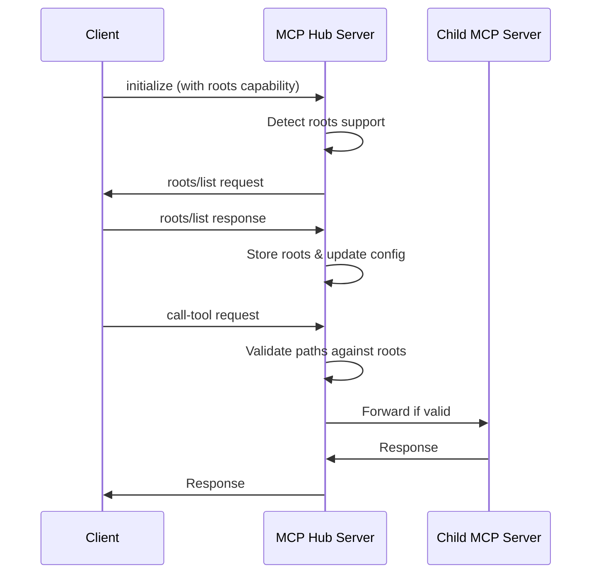

# Roots Capability Implementation

This document describes the implementation of the **roots capability** in the MCP Hub Server, which allows clients to define operational boundaries for the server's operations.

## Overview

The roots capability is part of the Model Context Protocol (MCP) specification that enables clients to declare a list of root URIs that define the operational boundaries for the server. This is particularly useful for security and privacy, ensuring that file system operations and other resource access are limited to client-approved locations.

## Key Features

- ✅ **Client Capability Detection**: Automatically detects when a client supports the roots capability
- ✅ **Dynamic Roots Querying**: Queries clients for their roots list during initialization
- ✅ **Live Updates**: Supports `roots/list_changed` notifications for dynamic root updates
- ✅ **Path Validation**: Validates tool call arguments against defined roots boundaries
- ✅ **Server Configuration**: Dynamically updates child MCP server configurations with root paths
- ✅ **Graceful Fallback**: Works seamlessly with clients that don't support roots

## Architecture

### Core Components

1. **`RootsManager`** (`src/roots-manager.ts`)
   - Manages the roots capability lifecycle
   - Handles client communication for roots querying
   - Provides path validation functionality
   - Updates server configurations with root information

2. **`McpHubServer`** (`src/mcp-hub-server.ts`)
   - Custom MCP server implementation that extends the standard server
   - Intercepts initialization messages to detect client capabilities
   - Handles bidirectional communication for roots functionality

3. **Enhanced Tool Validation**
   - The `call-tool` command now validates path arguments against roots
   - Automatically detects path-like arguments and enforces boundaries

### Communication Flow



## Usage Examples

### Client Declaration

A client declares roots support in the initialization:

```json
{
  "jsonrpc": "2.0",
  "id": 1,
  "method": "initialize",
  "params": {
    "capabilities": {
      "roots": {
        "listChanged": true
      }
    }
  }
}
```

### Server Querying Roots

The server automatically queries for roots:

```json
{
  "jsonrpc": "2.0",
  "id": "roots-1-1234567890",
  "method": "roots/list"
}
```

### Client Response

```json
{
  "jsonrpc": "2.0",
  "id": "roots-1-1234567890",
  "result": {
    "roots": [
      {
        "uri": "file:///home/user/project",
        "name": "Project Directory"
      },
      {
        "uri": "file:///home/user/documents",
        "name": "Documents"
      }
    ]
  }
}
```

### Path Validation

When a tool call contains paths, they are validated:

```javascript
// This would be ALLOWED
{
  "serverName": "filesystem",
  "toolName": "read_file",
  "toolArgs": {
    "path": "/home/user/project/src/main.ts"
  }
}

// This would be DENIED
{
  "serverName": "filesystem", 
  "toolName": "read_file",
  "toolArgs": {
    "path": "/etc/passwd"
  }
}
```

## API Reference

### RootsManager

#### Methods

- `initializeWithCapabilities(capabilities: ClientCapabilities)`: Initialize with client capabilities
- `queryRoots(sendRequest: Function): Promise<Root[]>`: Query client for roots
- `isPathInRoots(path: string): boolean`: Validate if a path is within allowed roots
- `getFilePathsFromRoots(): string[]`: Extract file paths from roots
- `updateServerConfigWithRoots(config: any): any`: Update server config with root paths
- `getSessionState(): SessionState`: Get current session state for debugging

#### Events Handled

- `roots/list_changed`: Automatically re-queries roots when client notifies of changes

### McpHubServer Tools

#### `get-roots`

Get information about current roots configuration:

```bash
# Example response
{
  "supportsRoots": true,
  "rootsListChanged": true,
  "rootsCount": 2,
  "roots": [
    {
      "uri": "file:///home/user/project",
      "name": "Project Directory"
    }
  ],
  "filePaths": ["/home/user/project"]
}
```

## Configuration Examples

### Basic Configuration

```json
{
  "mcpServers": {
    "filesystem": {
      "command": "filesystem-server",
      "args": ["--read-only"]
    }
  }
}
```

### Dynamic Configuration (Updated by Roots)

When roots are provided, filesystem servers are automatically updated:

```json
{
  "mcpServers": {
    "filesystem": {
      "command": "filesystem-server", 
      "args": [
        "--read-only",
        "/home/user/project",
        "/home/user/documents"
      ]
    }
  }
}
```

## Security Considerations

### Path Validation Logic

The roots validation implements the following security measures:

1. **URI Normalization**: Converts relative paths to `file://` URIs for consistent comparison
2. **Prefix Matching**: Ensures paths start with (are within) defined root URIs  
3. **Case Sensitivity**: Respects file system case sensitivity
4. **Default Allow**: When no roots are specified, all operations are allowed (backwards compatibility)

### Validation Triggers

Path validation is triggered for tool arguments that:
- Have keys containing: `path`, `file`, `filepath`, `filename`, `directory`, `folder`
- Have string values starting with `/` (Unix paths)
- Have string values containing `file://` (file URIs)

## Error Handling

### Access Denied

When a path is outside roots boundaries:

```json
{
  "content": [
    {
      "type": "text",
      "text": "Access denied: Path '/etc/passwd' is outside the allowed roots boundaries. Current roots: [\"file:///home/user/project\", \"file:///home/user/documents\"]"
    }
  ],
  "isError": true
}
```

### Timeout Handling

Roots queries have a 10-second timeout to prevent hanging connections.

## Testing

### Running Tests

```bash
# Build the project
npm run build

# Compile and run tests
npx tsc test/roots-test.ts --outDir dist/test --moduleResolution node --target es2020 --module esnext
node dist/test/test/roots-test.js
```

### Test Coverage

The test suite covers:
- ✅ Roots manager initialization
- ✅ Client capability detection (with/without roots)
- ✅ Path validation logic (valid/invalid paths)
- ✅ File path extraction from roots
- ✅ Server configuration updates
- ✅ Roots query request formatting
- ✅ Integration flow testing

## Migration Guide

### For Existing Deployments

The roots capability is fully backwards compatible:

1. **No Client Changes Required**: Clients without roots support continue working normally
2. **Default Behavior**: Without roots, all paths are allowed (same as before)
3. **Gradual Adoption**: Can be enabled incrementally as clients add roots support

### For Client Developers

To add roots support to your client:

1. Declare the `roots` capability in initialization
2. Implement the `roots/list` method to return your allowed roots
3. Optionally implement `roots/list_changed` notifications for dynamic updates

## Troubleshooting

### Common Issues

1. **Roots not detected**: Ensure the client declares the `roots` capability in initialization
2. **Paths rejected**: Verify paths are within declared root boundaries
3. **Query timeout**: Check network connectivity and client responsiveness

### Debug Information

Use the `get-roots` tool to inspect current roots state:

```bash
# Example debug output
{
  "supportsRoots": true,
  "rootsCount": 2,
  "roots": [...],
  "filePaths": [...]
}
```

## Performance Considerations

- **Lazy Initialization**: Roots are only queried when the client supports them
- **Efficient Path Checking**: Uses string prefix matching for fast validation  
- **Minimal Overhead**: No performance impact for clients without roots support
- **Configurable Timeouts**: Prevents hanging on unresponsive clients

## Future Enhancements

Potential areas for enhancement:
- **Pattern Matching**: Support for glob patterns in root definitions
- **Recursive Validation**: Validate nested paths in complex tool arguments
- **Resource Roots**: Extend beyond file systems to other resource types
- **Audit Logging**: Log all path validation decisions for security monitoring

---

This implementation provides a robust, secure, and backwards-compatible roots capability that enhances the MCP Hub Server's ability to respect client-defined operational boundaries while maintaining full functionality for existing deployments.
